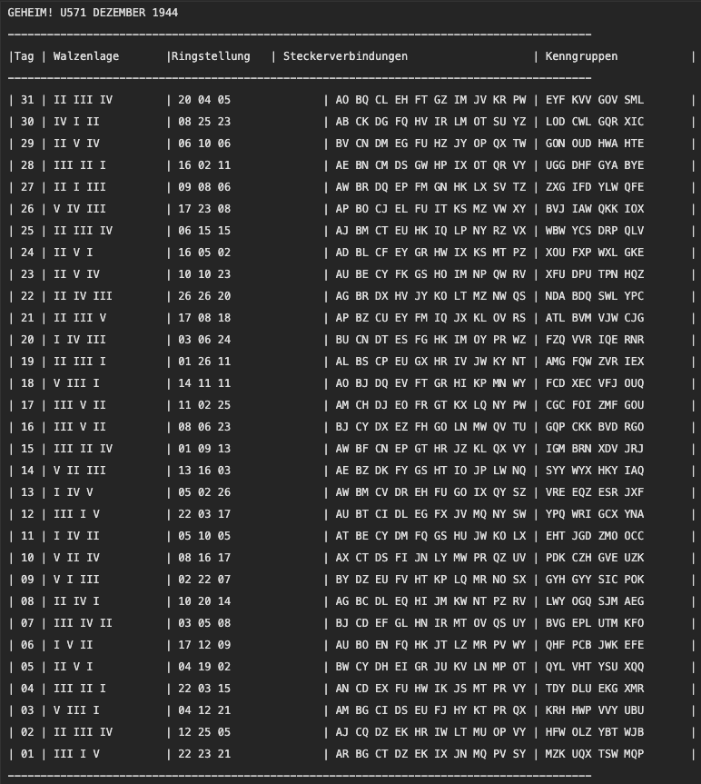
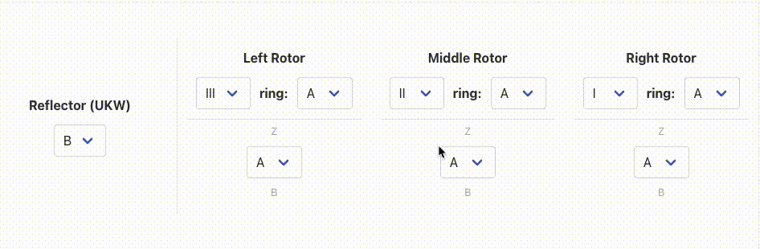
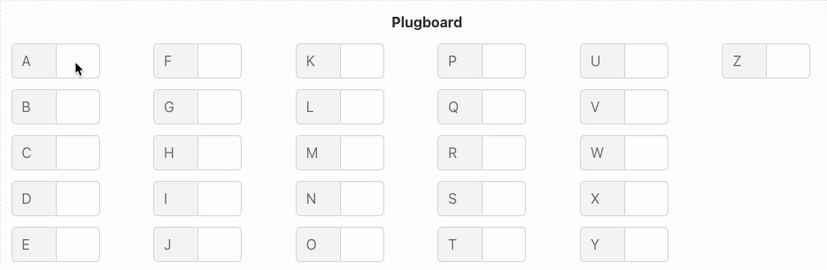
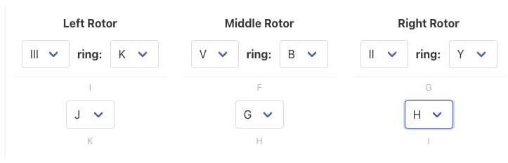
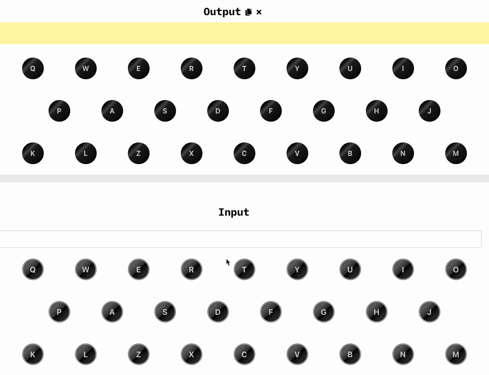
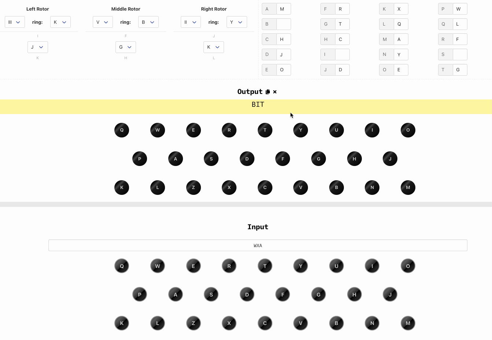
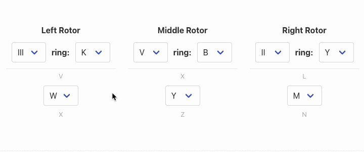
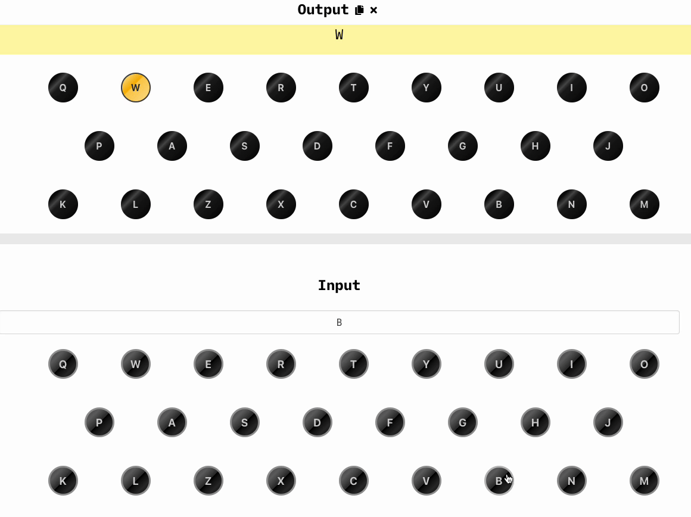

# Enigma JS - The Enigma I simulator

> A JavaScript implementation of the Enigma I machine.


<!-- @import "[TOC]" {cmd="toc" depthFrom=1 depthTo=6 orderedList=false} -->

<!-- code_chunk_output -->

- [Enigma JS - The Enigma I simulator](#enigma-js-the-enigma-i-simulator)
  - [History](#historyhttpswwwcryptomuseumcomcryptoenigmahisthtm)
  - [How to use](#how-to-use)
    - [Concepts](#concepts)
    - [Codebooks](#codebooks)
    - [Encrypting a message](#encrypting-a-message)
      - [Setting the header](#setting-the-header)
    - [Decrypting a message](#decrypting-a-message)
  - [Further reading](#further-reading)
  - [Contributing and Development](#contributing-and-development)

<!-- /code_chunk_output -->


See this documentation in [English](README.md) | [Português](README.pt.md)

This is part of my video series on the Enigma machine. You can watch the videos on my [YouTube channel](https://youtube.lsantos.dev) (in Portuguese).

## [History](https://www.cryptomuseum.com/crypto/enigma/hist.htm)

The Enigma I was a German cipher machine used by the German military during World War II. It was used to encrypt messages sent by the German Wehrmacht (the army). The Enigma I was used by the German military from 1923 to 1942. Despite other implementations of this type of machine being found in history (like Theo Van Hengel's dutch cipher machine from 1915), the Enigma is considered the first rotor-based cipher machine to be widely successful as a commercial machine and a military device.

The first prototypes were created by Arthur Scherbius, a german electric engineer, in 1918, but the first commercial version was only used in 1923. The Enigma was not a single machine but a series of rotor-based devices; you can check all the models [here](https://www.cryptomuseum.com/crypto/enigma/tree.htm).

Rotor-based devices use a set of rotors to encrypt and decrypt messages. The Enigma I has a set of five rotors, each one with 26 positions, of which you can chose 3. The rotors are placed in a specific order and each one has a specific starting position. The rotors are connected to a keyboard and a lampboard. The keyboard is used to type the message to be encrypted and the lampboard is used to display the encrypted message. The rotors are connected to each other and to the keyboard and lampboard. When a key is pressed, the signal goes through the rotors and is reflected in the reflector wheel. The rotors are connected in a way that the signal is reflected in a different position than the one it was sent. This is how the message is encrypted.

Besides the rotors, the Enigma I has a plugboard. The plugboard is a set of 13 pairs of letters. The plugboard is used to connect two letters together to form a switching pair. This is useful because the Enigma I has a limited number of rotors and the same letter can be encrypted in different ways. This is one of the most important parts of the machine because it's the one that creates the different combinations. Despite having all 13 pairs, you can choose not to plug one letter in another, which means the letter won't be switched.

Each time the keyboard is pressed, the signal goes through the lampboard, is shifted or not, then rotate the rotors a position forward, goes through all the rotors, is reflected in the reflector wheel, goes through all the rotors again, is shifted again in the plugboard, and finally goes through the lampboard. This is how the message is encrypted.

For more information about the Enigma I, check the Crypto Museum website [here](https://www.cryptomuseum.com/crypto/enigma/i/index.htm).

## How to use

The Enigma could be used to both encrypt and decrypt messages in the same machine. But before a message could be written there are a few concepts you need to go through first.

### Concepts

- **Entry wheel (Eintrittswalze or ETW)**: Is the entry point of the signal to the rotors
- **Plugboard (Steckerbrett)**: Is a set of 13 pair of letters that will be switched between each other, which means that if an A is connected to a B, once an A goes in, it'll go out as B. You can either connect a key or not, if the key is not connected there will be no substitution.
- **Rotors**: Each rotor is a circular disk like a cogwheel with number (or letters) from 1 to 26 around them. On the inside, each entry point is connected to a different scrambled output on the other side. There's a small window on the machine where you can see the current rotor position.
- **Daily Key (Grundstellung)**: It's the initial position the rotors are put in. Before 1940, this was sent along with the codebooks for the settings, after 1940, the daily key was set by message basis.
- **Ring setting (Ringstellung)**: Each rotor also came with a special shifting mechanism that allowed you to rotate the alphabet, creating an additional shift in the cipher. This setting was called the ring setting.
- **Reflector (Umkehrwalze or UKW)**: It's the final step of the encryption, it connects two letters in a fixed way, and it's what allows the same machine to be used to both encrypt and decrypt messages.

More information on how the Enigma works can be found:

- https://www.cryptomuseum.com/crypto/enigma/working.htm
- https://www.cryptomuseum.com/crypto/enigma/wiring.htm

### Codebooks

The army sent monthly code books to all soldiers, these code books had the basic daily configuration of an Enigma machine, all codes were reset at midnight. You can check an example of this code book [here](https://pastebin.com/pkJBjDEv).



- **Tag**: The day
- **Walzenlage**: The rotor selection for the day, from the leftmost rotor to the rightmost rotor
- **Ringstellung**: Explained above
- **Steckerverbindungen**: The plugboard pairs, at any given time, only 10 pairs would be connected
- **Kenngruppen**: The control group, used to allow messages produced in different days to be read without the need of all the settings at all times.

### Encrypting a message

Let's encrypt the following message: `ENIGMAISCOOL` which is 12 characters long.

There are two ways to encrypt a message using enigma, but both of them start by setting the correct settings according to the codebook. Let's exemplify by taking the 17th of December from the above code book and setting it into the enigma.

We first start with the rotor and ring settings:



Our rotors are III, V, II. And the ring settings are 11 (K), 2 (B) and 25 (Y).

Now, we set the plugboard:



#### Setting the header

Every message came with a header, this header had the following information:

```
hours = total pages = current page = characters in the message = setting key =
```

Before 1940, the key was typed in twice as the setting was already on the code book. To set a valid setting, we randomly choose three letters, let's say `JGH` and set the rotor positions to these letters:



Now we randomly choose three other letters that will be our key, let's say `WXA` and we type in the keyboard, we'll obtain a new set of three letters, which are `BIT`:



This is the key we'll use in our header, which will be:

```
1840 = 1tl = 1tl = 12 = JGH BIT =
```

Next, we choose one of the three-letter groups in the Kenngruppen (on the codebook) for our day. So let's pick `CGC` and two other letters at random, like `OS` so `OSCGC`, this is the control group for our message, it's the first part of the message which will __not__ be encrypted:

```
1840 = 1tl = 1tl = 12 = JGH BIT =

OSCGC
```

The last step is to set the rotors to our key (`WXA`) and encrypt our message:



The final message will be:

```
1840 = 1tl = 1tl = 12 = JGH BIT =

OSCGC CBNEK JAJIH ZX
```

Enigma grouped the letters into five-letter groups so it's harder to figure the message.

### Decrypting a message

So now we received the above message, the first thing is to look at the first five-letter group, we ignore the first two letters and look at the Kenngruppen to find the day the message was sent, then we set the machine accordingly.

Then, we put the initial setting, which is in the header: `JGH`



After that, we type in the key that was sent: `BIT` and we shoulg get `WXA` back.



Now we set the key as the rotor position and type in the message without the first block:


Now we have the final message: `ENIGM AISCO OL` and we just need to join it: `ENIGMAISCOOL`

## Further reading

If you want to continue reading, I've prepared [this big list of links](https://lsantos.dev/yt-enigma-referencias) which you can take a look.

Professor David Kahn's book [The Codebreakers](https://www.amazon.com/Codebreakers-Comprehensive-History-Communication-Internet/dp/0684831309/ref=sr_1_1?keywords=the+codebreakers&qid=1669233736&sr=8-1) is a great read if you want to learn more about the Enigma and the people who broke it.

Also, professor [Mike Pound](https://github.com/mikepound) has a very nice Java implementation of Enigma which I used to base myself in some of the logic, check it out [here](https://github.com/mikepound/enigma).
## Contributing and Development

To contribue to the project, please submit a PR. This project is built using Vue.js + Vite and TypeScript. All the code is commented so the main parts of the logic are not lost.

To run locally first install all the packages with `npm install` and run `npm run dev` this should spin up a local vite server.
